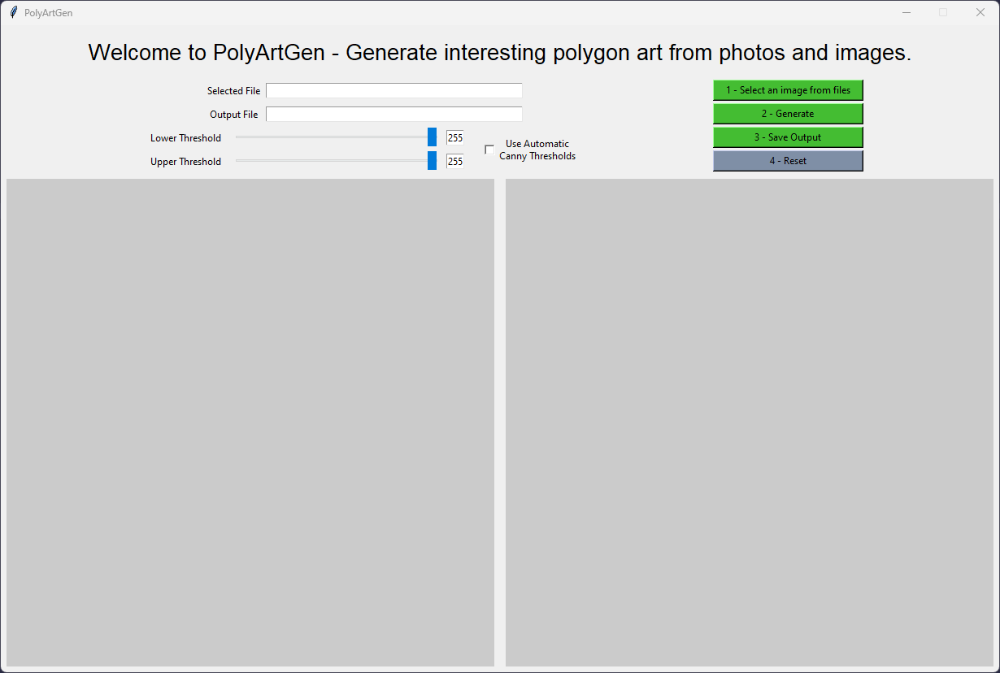
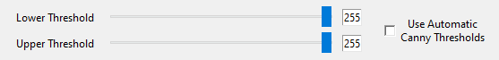
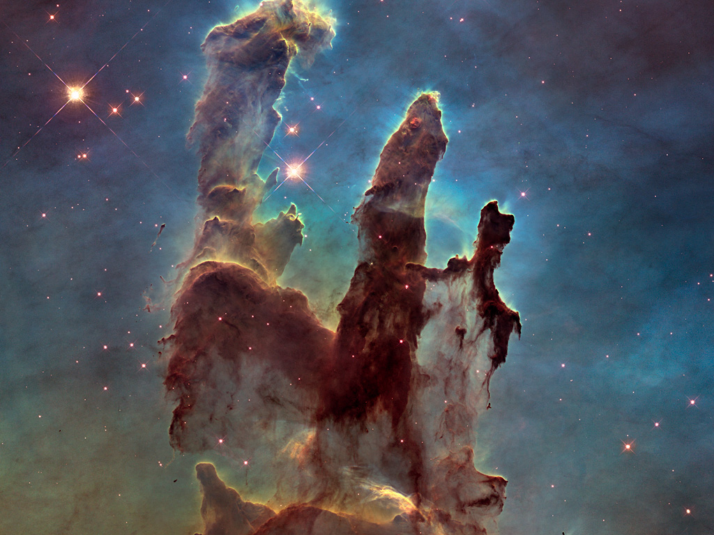
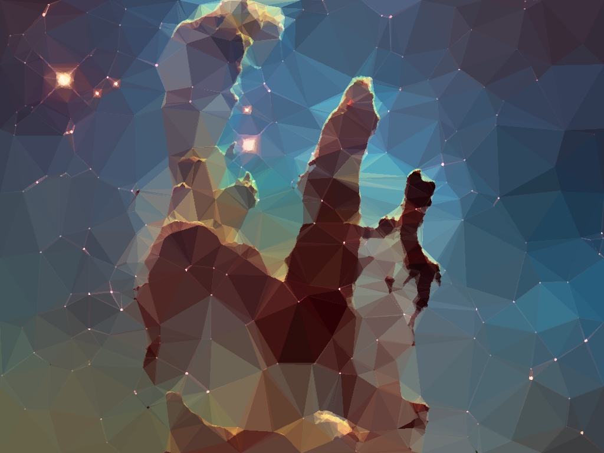

# PolyArtGen

PolyArtGen is a tool for converting an existing image into approximated, geometric, primitive shapes by utilizing Canny Edge detection to find significant edges in the image, Delaunay Triangulation of the edges, and filling the resulting triangular mesh with the average color of all pixels inside each triangle.

**NOTE: Images with higher resolution will take significantly longer to render.**

## Using

Using PolyArtGen is very simple:
1. Select an image from files
2. Generate the image
3. Save the output
4. Reset to generate more images

## Canny Thresholds
PolyArtGen allows selection of the Canny threshold values in order to customize the density of triangles that are ultimately generated by the app.  Generally, there is not a one-size-fits-all value for both thresholds and depends significantly on the input image.  Adjust the sliders to control the values used for the thresholds:

Alternatively, use the "[Automatic Canny Thresholds](https://pyimagesearch.com/2015/04/06/zero-parameter-automatic-canny-edge-detection-with-python-and-opencv/)" checkbox to let the application decide the threshold values.

## Example Input

## Example Output

## Test Image Citations

All test images are sourced from the [Hubble Space Telescope](https://esahubble.org/) and are authorized for use with the following [copyright](https://esahubble.org/copyright/).

### **heic0515a**

Credit:
NASA, ESA and Allison Loll/Jeff Hester (Arizona State University). Acknowledgement: Davide De Martin (ESA/Hubble)

### **heic1310a**

Credit:
NASA, ESA, and C. Robert O’Dell (Vanderbilt University)

### **heic1501a**

Credit:
NASA, ESA/Hubble and the Hubble Heritage Team